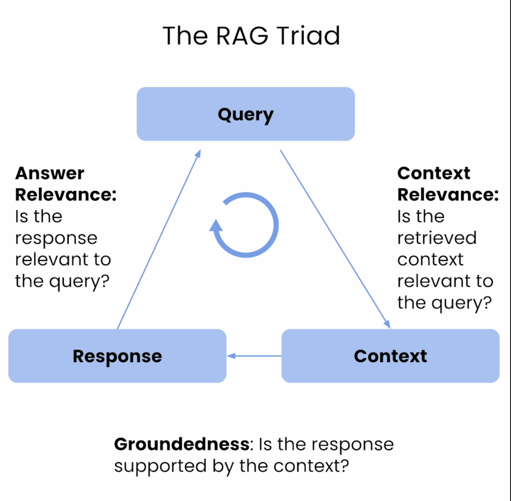
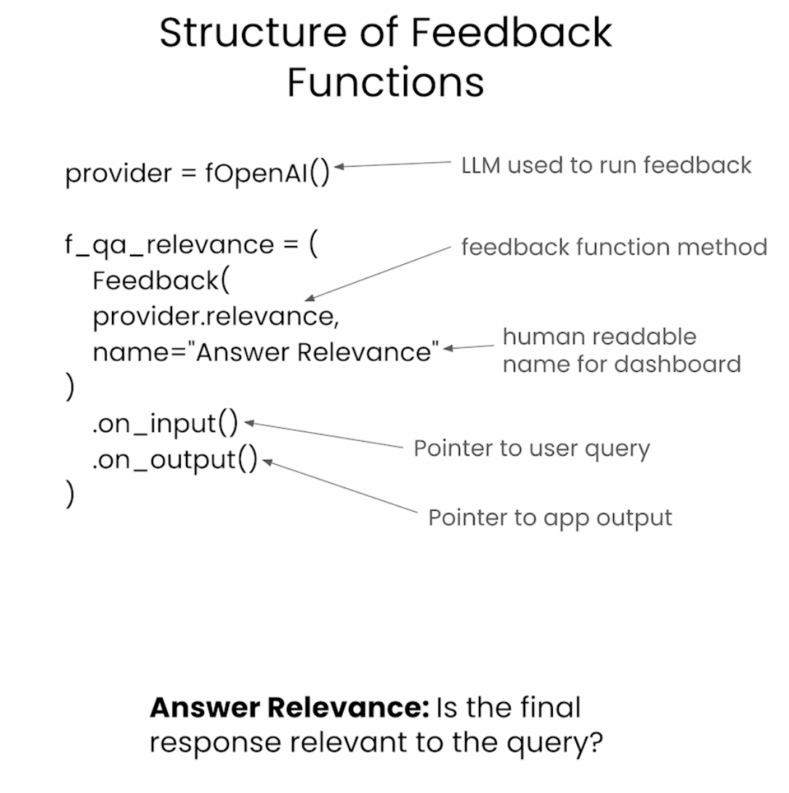
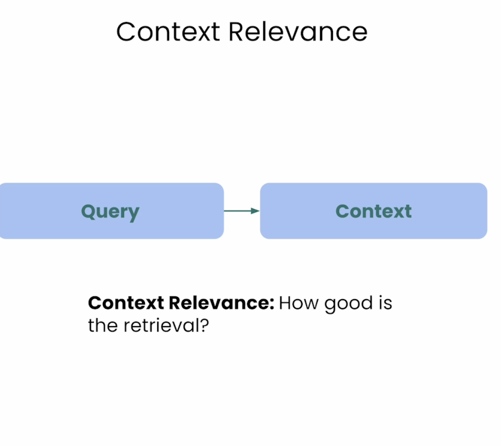
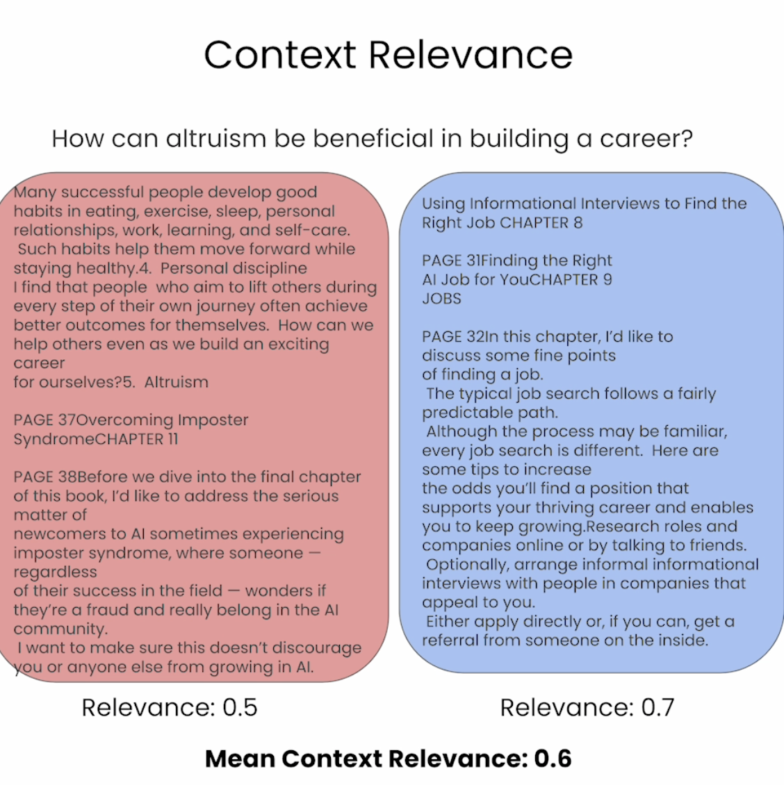
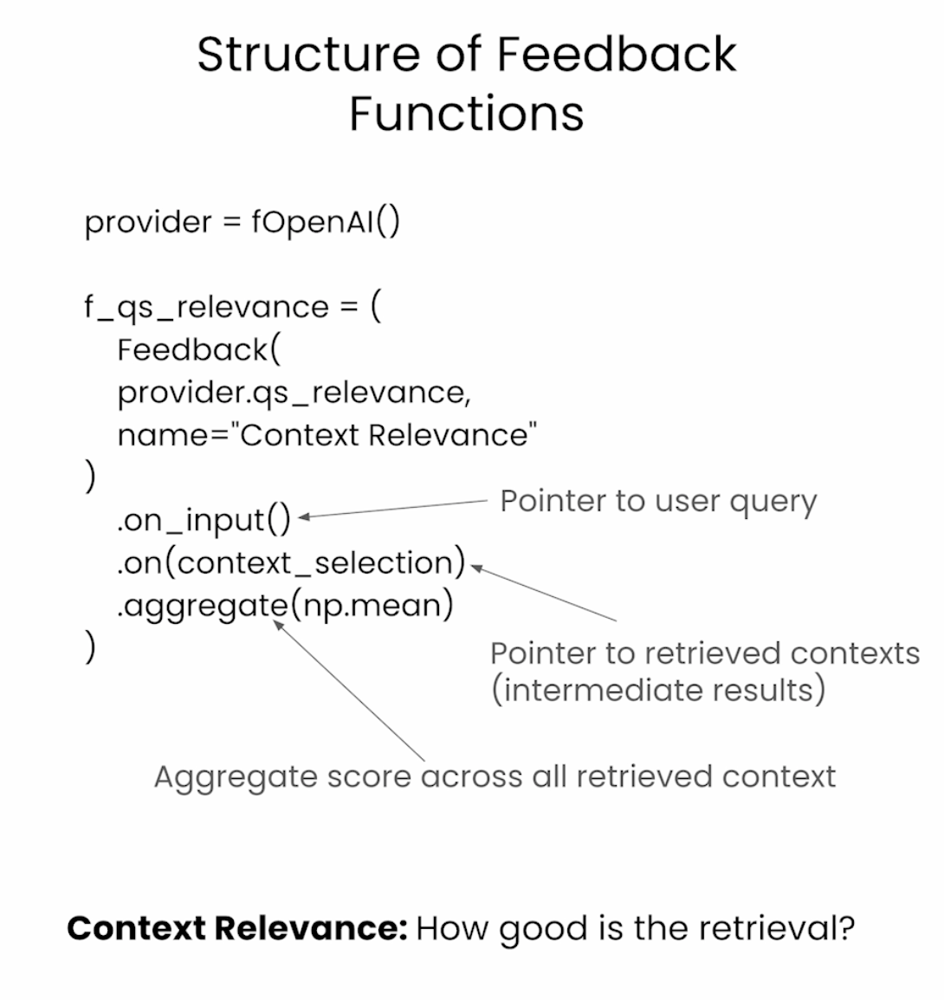
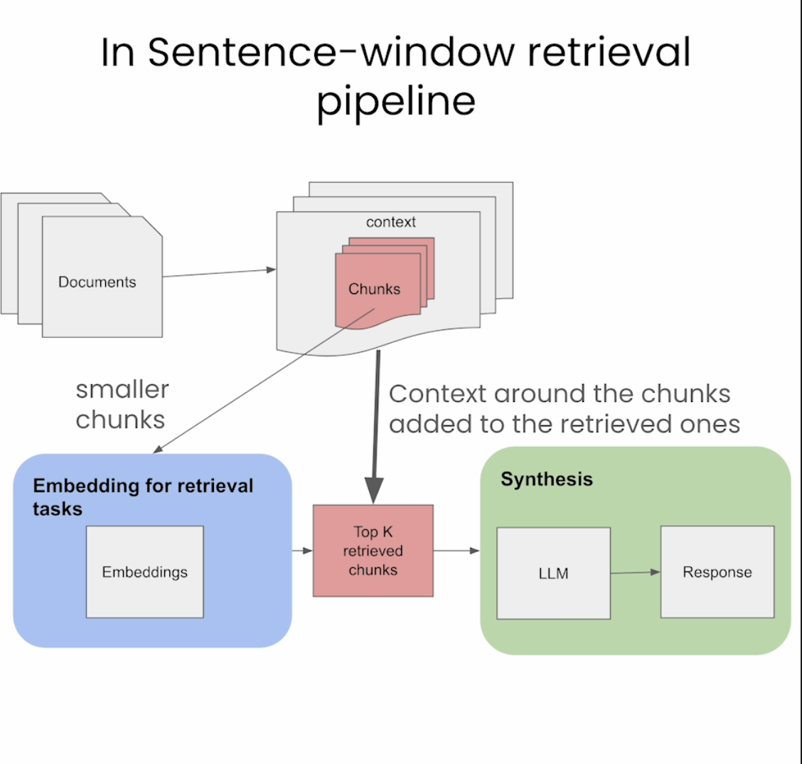
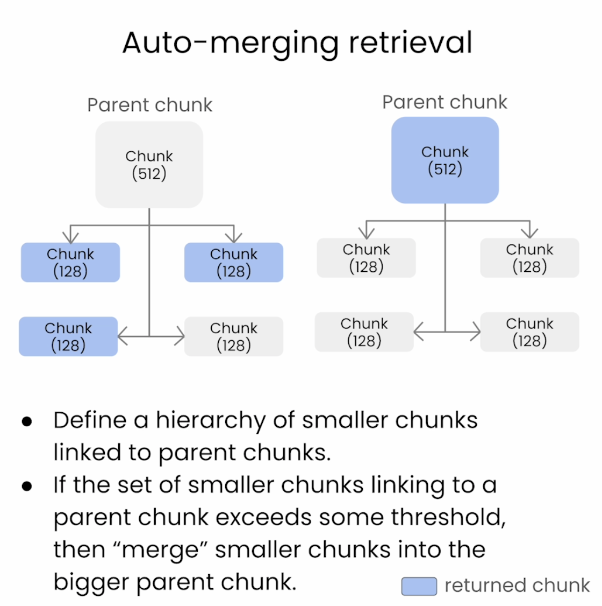
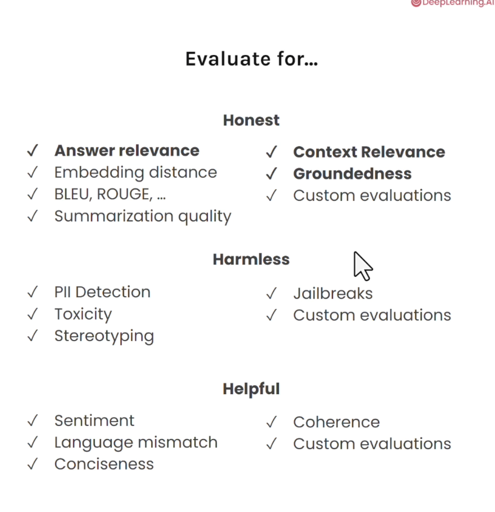

## Setup RAG Basic pipeline with LlamaIndex

# Ingestion
  Documents -> chunks -> Embeddings -> Index

# Retrieval                   | # Synthesis     |
    Query -> Index -> Top K -> | LLm -> Response |
    Query -------------------->|                 |

# Feedback functions

# Context Relevance

 --> relevance scores

### senter window retrieval

### Auto-merginv retrieval

### All different types of evaluations
